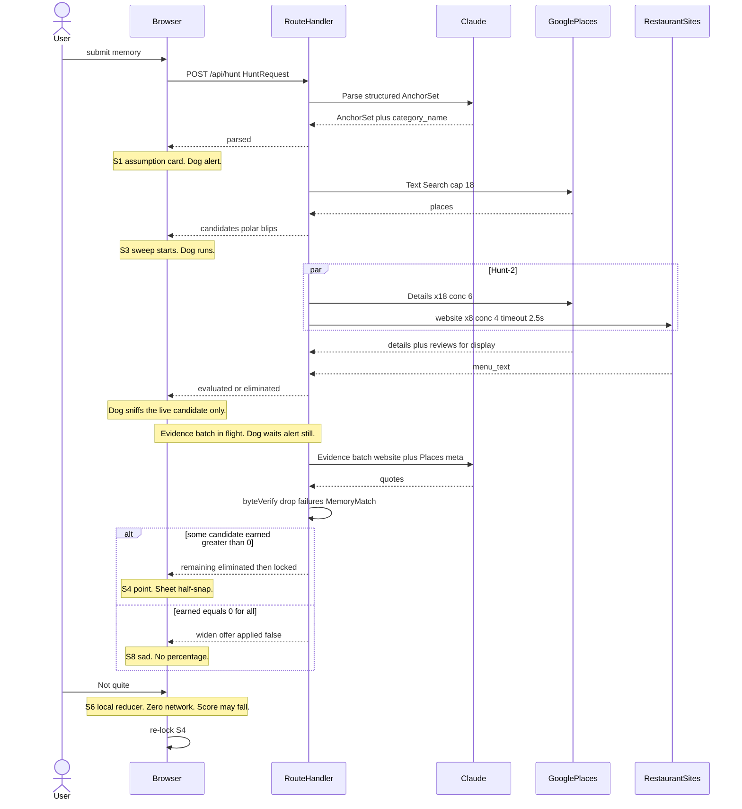
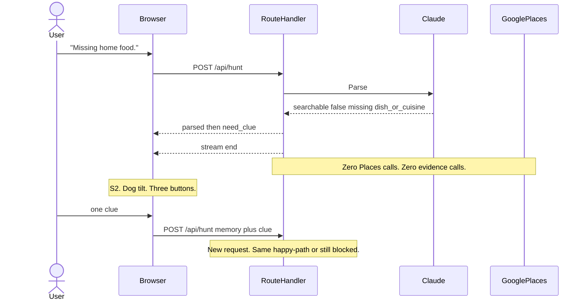
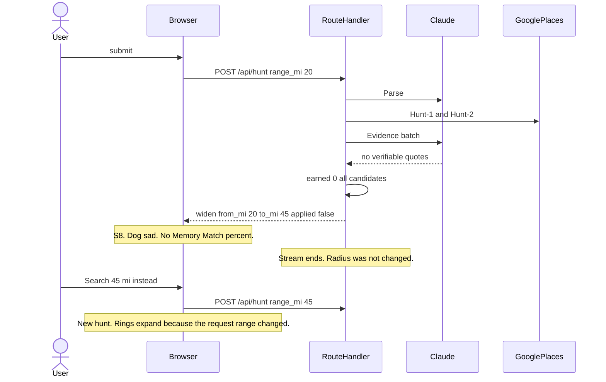
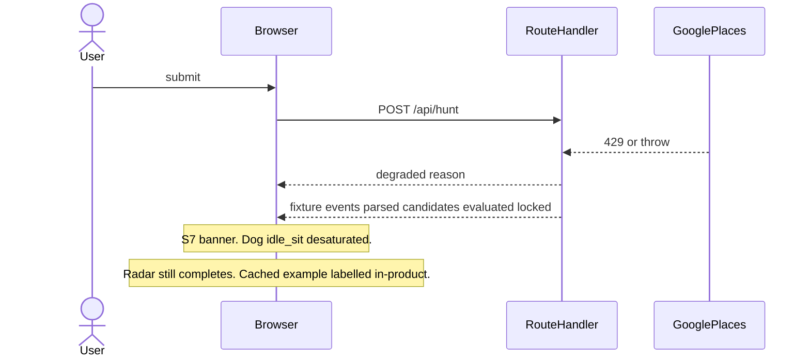
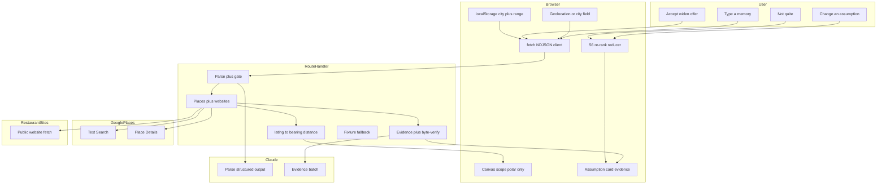

# Flavor Hunter — System Design

| Field | Value |
|---|---|
| Status | Approved for build |
| Version | v1.0 |
| Date | 2026-08-27 |
| Purpose | Engineering source of truth for architecture, diagrams, and shared contracts |
| Upstream | `02-prd.md` · `03-tech-design.md` · `06-frontend-stack-and-feature-map.md` |
| Downstream | `09-frontend-machines.md` · `10-pipeline-stages.md` |
| Code contracts | `../schemas/index.ts` · `../prompts/` |

`03` remains the stack rationale and Google Maps terms analysis. This document owns **diagrams, interface contracts, and the tradeoff log**. Where `03` says `EventSource` / SSE, this document and `06` §1 supersede it: `POST` + `fetch` + NDJSON `ReadableStream`.

Do not start app scaffolding until the contracts in §4 are treated as frozen.

---

## 1. Architecture

```
BROWSER  (no API keys, no place lat/lng, no Places field cache)
  │
  │  POST /api/hunt
  │  body: HuntRequest
  │  ← NDJSON stream  (fetch + ReadableStream)
  │
  ▼
NEXT.JS ROUTE HANDLER  ── the only trusted context  (Vercel)
  │
  ├─ 1. PARSE ──── Claude structured output → AnchorSet + category_name
  │                 emit `parsed`
  │
  ├─ 2. GATE ──── location + dish_or_cuisine + intent == find_restaurant
  │                 fail → emit `need_clue`, end stream, zero Places / evidence calls
  │
  ├─ 3. HUNT-1 ── Places Text Search (keyword + includedType + price + bias)
  │                 cap 18 · in-range query-shape broadening allowed (not radius)
  │                 emit `candidates`  (polar blips only)
  │
  ├─ 4. HUNT-2 ── Place Details ×18 (conc 6) + website fetch ×8 (conc 4, 2.5 s)
  │                 each landing → `evaluated`
  │                 cheap metadata / name / benchmark cuts → `eliminated`
  │                 dog sniffs the candidate being fetched; never busy-runs
  │
  ├─ 5. EVIDENCE ─ one batched Claude call over survivors
  │                 substrate: restaurant website text + Places metadata
  │                 NEVER Google review bodies
  │                 byte-verify every quote; drop failures
  │                 dog WAITS (alert, still) for this entire call
  │                 then remaining `eliminated` + `locked` (or `widen` offer)
  │
  └─ FALLBACK ── any throw / Places 429 → fixture + `degraded`
                 radar still completes visually

NO durable store. NO Places content cache.
Retained across requests: nothing of the user's. place_id may be used
inside a single request; discarded at the end.
```

**Refinement (FR-10) never hits this diagram.** After `locked`, the candidate set and evidence live in browser memory. A correction is a pure reducer. Zero network.

### 1.1 Trust boundary

| Side | May hold | Must never hold |
|---|---|---|
| Browser | memory text (this session), polar blips, evidence already returned, city+range in `localStorage` | API keys, place lat/lng, Places fields other than what the stream already emitted for display |
| Route Handler | keys, rounded coords for this request, fetched payloads until the response ends | anything written to disk, logs of memory text / anchors / Places content, review text inside an LLM payload |
| Claude | parse input (memory text); evidence input (website text + Places **metadata**) | Google review bodies; training / fine-tune use |

### 1.2 Batched evidence + wait pose (locked)

Hunt visualization needs a real event every few hundred milliseconds. Evidence is **one** Claude call (~3.5 s P50). Those two facts do not permit fake per-candidate LLM sniffs after the batch returns.

| Phase | Dog | What is true |
|---|---|---|
| Hunt-2 fetch landing | `sniff` that candidate, then `run` to the next | Details / website just arrived |
| Cheap cut (benchmark name, type contradiction, explicit named negation) | `reject` then `run` | A deterministic rule fired |
| Evidence batch in flight | **`alert`, still — wait** | Nothing new is being evaluated yet |
| Batch returns, byte-verified | remaining `eliminated` then `point` / `sad` | Real LLM result, not a replay |

Do not animate a sniff loop over candidates while the evidence call is outstanding. That is the same class of lie as a fabricated quote.

### 1.3 In-range broadening vs radius widen

| Kind | Automatic? | Event |
|---|---|---|
| Query-shape: drop `price_band`, then `dish` → `cuisine` | **Yes**, still inside the user's range | `broadened` then a new `candidates` |
| Radius: 20 mi → 45 mi | **Never.** Offer only | `widen` with `applied: false` |

Zero Places hits inside the current range trigger query-shape broadening first. If still empty, emit `widen` (offer) or, at the top preset, `widen` with `offered_mi: null` (no answer).

---

## 2. Sequence diagrams

Four paths. These are the judging-critical ones.

### 2.1 Happy path (A1) — parse → hunt → lock → local refine



### 2.2 Need clue (A10) — stream ends, zero downstream cost



### 2.3 No answer / widen offer (A6) — never auto-widen radius



If `range_mi` is already 45, emit `widen` with `to_mi: null` — no button, copy only: nothing clears the bar.

### 2.4 Degraded (NFR-3) — fixture, labelled, radar still completes



The fixture is the primary demo query only. It is insurance, not a data store. The banner is mandatory — an unlabelled fixture is a fabricated hunt.

---

## 3. Swimlanes

### 3.1 Who does what



### 3.2 Lane / does / does not

| Lane | Does | Does not |
|---|---|---|
| User | Memory, clue tap, assumption edit, Not quite, widen accept, range/city | Authenticate, save a profile, pick from a directory |
| Browser | Geolocation on first interaction, polar scope, three machines, local refine, `localStorage` city+range | Hold API keys, plot streets, re-search on refine, cache Places fields |
| Route Handler | Keys, parse, gate, fan-out, polar conversion, byte-verify, rate limit, fixture | Database, Places TTL cache, log memory text, send review bodies to Claude |
| Claude | Two calls: parse and evidence | Tool loops, planning, embeddings, review-text quotes |
| Places | Discovery + display attributes + ≤5 reviews for **display** | LLM substrate |
| Restaurant website | Menu / about text for LLM evidence | Required — missing site ⇒ `limited evidence`, still scorable from metadata matches |

### 3.3 Coordinates to the client — revised 2026-08-27

**Superseded.** An earlier version sent polar coordinates only and withheld `lat`/`lng` as a
belt-and-braces guarantee against §3.2.3(e). That guarantee is no longer needed and is no
longer possible: the basemap is now the Google Maps JS API and candidates are **Advanced
Markers**, which require real coordinates to place (PRD FR-6a). Displaying Places content on
Google's own map is exactly what §14.2 permits, so `lat`/`lng` on the client is normal here,
not a risk.

The server still computes polar values, because the scope overlay and the log both use them:

```
distance_mi = haversine(center, place) * 0.621371
bearing_deg = (atan2(east, north) in degrees + 360) % 360
```

Search center = browser coords (rounded to 3 dp) when `LocationMode=current`, else a one-shot
geocode of `city_label` used **only inside the handler**.

Client payload per candidate: `{ id, lat, lng, bearing, distance }`.

| Still true | Now false |
|---|---|
| Coordinates are never written to `localStorage` beyond the user's own 3-dp center | ~~Client never receives lat/lng~~ |
| No Places field other than `place_id` / lat-lng is retained anywhere | ~~Client never plots a street map~~ |
| Names, addresses, reviews, price levels discarded at end of request | |
| Attribution rendered, unaltered (§15.4) | |

Compliance now rests on **the basemap being Google's**, which is a build-time fact
(one Map ID, one SDK) rather than a per-payload discipline — arguably easier to keep true.

---

## 4. Frozen contracts

Canonical TypeScript / Zod: [`../schemas/index.ts`](../schemas/index.ts). Frontend and pipeline both implement against that file. Duplicate types in this section are commentary.

### 4.1 `HuntRequest`

```ts
{
  memory_text: string          // required, non-empty after trim
  locale: string               // BCP-47, from navigator or chip
  range_mi: 5 | 10 | 20 | 45   // default 20
  city_label: string           // displayed + used if coords absent
  coords?: { lat: number; lng: number }  // already rounded to 3 dp
}
```

- Coordinates are rounded **in the browser** before transmit. Handler rejects unrounded values (more than 3 decimal places).
- Seeded example chips set `memory_text` + `city_label` + `range_mi` and omit `coords` (server geocodes the example city).
- Share links (P1 FR-12) may encode memory + city name only — never coords.

### 4.2 `AnchorSet`

Eleven anchors from research §5. Absent scalars are `null`, never a guessed string. Empty arrays stay `[]`.

| Field | Shape | Notes |
|---|---|---|
| `dish` | `{value, confidence} \| null` | |
| `cuisine` | `{value, confidence} \| null` | |
| `substyle` | `{value, confidence} \| null` | **Memory origin lives here.** "湖南" is not a search city (A11) |
| `sensory` | `{value, confidence}[]` | |
| `direction` | enum or null | `family_home` \| `street_stall` \| `restaurant_formal` \| `diaspora_adapted` \| `americanized_chain` |
| `person` | `{value, confidence} \| null` | |
| `setting` | `{value, confidence} \| null` | |
| `price_band` | `{value, confidence} \| null` | Places-filterable if present |
| `ritual` | `{value, confidence} \| null` | |
| `benchmark` | `{value, confidence} \| null` | Named venue to exclude from lock (A4) |
| `negation` | `{field, value}[]` | Exclusions only. Never copied into a positive field (A9) |
| `query_variants` | `string[]` | Spellings the dish may be **listed under** on Google Maps: original script, romanisations, common English renderings. Stage 1 searches across these, not the user's spelling alone (PRD FR-1) |
| `fallback_ladder` | `{ dish?, cuisine?, relation }[]` | Ordered nearest-first. `relation` is **required** and is shown to the user. Drives the specificity door (PRD FR-4b-2) |

Envelope:

```ts
{
  intent: "find_restaurant" | "find_recipe" | "find_grocery" | "other"
  category_name: string
  category_confidence: number   // [0,1]; < 0.5 → render with ?
  anchors: AnchorSet
  searchable: boolean
  missing_required: ("location" | "dish_or_cuisine" | "intent")[]
}
```

**A11 rule:** if the memory names a place of origin, that string is `anchors.substyle`. Search location is only `HuntRequest.city_label` / `coords`. Searching Hunan for a Boston user is a release blocker.

### 4.3 NDJSON events

Transport: `POST /api/hunt`, `Content-Type: application/json`, response `Content-Type: application/x-ndjson`. One JSON object per line. `EventSource` is forbidden (GET-only). Client uses `fetch` + `ReadableStream` and aborts on unmount.

`06` §4.4 is the product table. This section is the payload schema. Additive event: `broadened` (in-range query-shape only).

| `type` | Payload | Stream continues? | UI |
|---|---|---|---|
| `parsed` | `{ category_name, confidence, anchors, searchable, missing_required }` | yes, unless immediately followed by `need_clue` | S1 |
| `need_clue` | `{ missing_required }` | **no** | S2 |
| `broadened` | `{ dropped: "price_band" \| "dish", now: string }` | yes | telemetry; still S3 |
| `candidates` | `{ count, blips: { id, lat, lng, bearing, distance }[] }` | yes | S3 · Advanced Markers placed at lat/lng; overlay uses bearing/distance |
| `evaluated` | `{ id, score_partial?: number }` | yes | promote blip; dog sniffs `id` |
| `eliminated` | `{ id, reason }` | yes | strike blip; dog `reject` |
| `widen` | `{ from_mi, to_mi: number \| null, why, applied: false }` | **no** | S8 · distance door. Rings do **not** expand until a new hunt. |
| `substitute` | `{ from: string, to: { dish?, cuisine?, relation }, applied: false }` | **no** | S8 · specificity door. Emitted alongside `widen`; either, both, or neither may be offered. `relation` MUST be displayed (PRD FR-4b-2) |
| `locked` | `{ ranked: RankedCandidate[] }` | **no** | S4 |
| `degraded` | `{ reason }` | yes — fixture events follow | S7 banner |

`RankedCandidate`:

```ts
{
  id: string                // request-scoped id, not a place_id echoed as such if avoidable
  name: string              // Places display name, this response only
  lat: number               // required to place the Advanced Marker
  lng: number
  distance: number          // miles
  bearing: number           // degrees
  score: number | null      // null ⇒ insufficient evidence; never 100
  limited_evidence?: boolean
  evidence: EvidenceLine[]
  excluded_by?: string
}
```

`place_id` stays on the server for the duration of the request so Details can be fetched. It is not required on the client. If sent, it is still discarded when the page unloads; never written to `localStorage`.

### 4.4 `EvidenceLine`

```ts
{
  anchor: string            // which anchor this line claims
  quote: string             // verbatim substring of a fetched payload
 source: "website" | "google_review" | "places_meta"
  mechanism: "llm_extracted" | "deterministic_match"   // provenance is inspectable (PRD FR-6b)
  source_name: string       // restaurant site host, or "Google"
  fetched_at: string        // ISO timestamp of the fetch, this request
  source_date?: string      // review date if any
  denominator?: string      // e.g. "2 of 5 available reviews"
  verified: true            // only emitted if byte-verify passed
}
```

Two production paths, both byte-verified on the server:

1. **LLM quotes** — from restaurant website text only. Drop any line whose `quote` is not a literal substring of `menu_text`.
2. **Deterministic review lines** — **P0, not optional** (PRD FR-6b). Anchor `value` and each
   `query_variants` entry matched as a substring of a Places review, **server-side, no LLM**.
   Verbatim by construction, so byte-verification is a formality rather than a filter.
   **Review text is never in any model payload** (§11.3). Display with required Google
   attribution.

   This path exists because Places has no menu field at all (`03` §5.1), so a restaurant with
   no website would otherwise produce zero evidence — and restaurants with no website are
   disproportionately the small immigrant-run places this product is for.

`places_meta` lines are structured (price, types) restated as a short quote of the metadata field actually returned — still substring-checked against the JSON the handler fetched.

If no line survives for an asked-about anchor: the panel shows `no evidence found`. The model must not invent a substitute; the handler must not pass through an unverified line.

### 4.5 Memory Match

Copied from PRD FR-9a. Handler computes this; the client may recompute it on refine from the same rubric.

```
Weights (only anchors the user supplied count in the denominator):

  dish                                  30
  sensory + substyle                    30
  cuisine + direction                   20
  person + setting + ritual
    + price_band + benchmark            20

An anchor earns its weight only if ≥1 verified EvidenceLine cites it.
Negations never add to earned or available.

If earned == 0: score = null (insufficient evidence). Do not emit a percentage.
Else: MemoryMatch = round(100 × min(0.97, earned / available))
```

Never 100. A user can add the evidence rows and reproduce the number.

---

## 5. Failure mapping

| Mode | Detection | Emit | Dog |
|---|---|---|---|
| Missing dish/cuisine | gate | `need_clue`, end | `tilt` |
| Non-restaurant intent | gate | `need_clue` or terminal copy via `parsed` + end; zero Places | `tilt` |
| Places 0 in range | empty Text Search | `broadened` then retry query-shape; else `widen` offer | `sad` if still empty |
| Website timeout | 2.5 s | skip; `limited_evidence` on that candidate | continue |
| LLM schema invalid | Zod | one retry with error appended; then fixture | S7 |
| Fabricated quote | byte-verify | **drop line**, never display | unchanged |
| Places 429 / throw | HTTP / catch | `degraded` + fixture | desaturated `idle_sit` |
| Location denied | browser | `city_label` manual; do not block | — |

Fabricated quotation is a correctness bug. Everything else degrades.

---

## 6. Tradeoff log

Closed. Do not relitigate unless Google Maps terms change. Format: decision / rejected / why / cost.

| Decision | Rejected | Why | Cost |
|---|---|---|---|
| **Fixed three-stage pipeline** (parse → hunt → evidence) | LangGraph / CrewAI / ADK / Agents SDK | Flow is linear, N≤18, NDJSON contract must be guaranteed. Submission says "three-stage pipeline" | No dynamic tool loops |
| **Next.js 15 App Router + Vercel** | Vite+separate API; Cloudflare Workers | One repo, Route Handler is the key proxy, largest docs surface under C5 | No native Agents SDK (irrelevant once runtime is rejected) |
| **Evidence coverage only** | Embedding / semantic-similarity term | Score must be hand-auditable; at N≤18 the S term rarely moved rank | Weaker "vibe" ranking — product wants proof |
| **Website as LLM substrate** | Google review text in the prompt | ToS §3.2.3(a)(i) grey area; we refuse it | Thinner evidence; 5-review ceiling is display-only |
| **Google Maps JS + Cloud-based Maps Styling**, camera locked in S3 | MapLibre/Mapbox; no basemap | MapLibre+Places prohibited; no-map is legal but blips without geography are informationally empty (FR-6a). Locking the camera removes overlay sync | Second billing SKU; Map ID setup step |
| **`fetch` + NDJSON** | `EventSource` SSE; WebSocket | Memory is a POST body; EventSource is GET-only | Slightly more client code |
| **Canvas RAF + DOM chrome** | SVG-everything; WebGL | 60 fps on a phone; 0 React re-renders during sweep | Blips are not in the a11y tree; labels stay DOM |
| **Client refine, no re-search** | Second Places round-trip | FR-10 is the demo second act; must not depend on network | Cannot discover new restaurants after correction |
| **No Places cache** | 10-minute LRU; pre-scrape JSON | ToS: only `place_id` and lat/lng | Cost control = fan-out caps + rate limit |
| **Widen offered, never automatic** | Silent 5→20→45 ladder | Range is the user's; diaspora food lives in suburbs but they still own the knob | One extra tap on A6 |
| **NFR-3 labelled fixture** | Live-only | Quota exhaustion during async judging is high-likelihood fatal | Must banner it or it is a lie |
| **Polar coords to the client** | Send lat/lng, draw a map | Compliance by construction | Client physically cannot render streets |
| **Batched evidence + wait pose** | Per-candidate evidence LLM; fake sniff replay after batch | Honest (F0), cheaper, fits the latency budget | ~3.5 s of still dog before lock — correct, not a bug |
| **Query-shape broaden in-range** | Immediate radius widen on 0 hits | Dropping price/dish still respects FR-4b | Extra Text Search call |
| **Deterministic review match, not LLM** | Send reviews to Claude for denser quotes | Terms | Review lines only when the anchor string actually appears |

---

## 7. Latency budget (unchanged from `03` §4)

| Stage | P50 | P95 |
|---|---|---|
| Parse (streaming first token) | 0.9 s | 2.0 s |
| Hunt-1 Text Search | 0.4 s | 0.8 s |
| Hunt-2 Details ×18 | 1.6 s | 3.2 s |
| Hunt-2 website ×8 | 1.2 s | 2.5 s |
| Evidence batched | 3.5 s | 7.0 s |
| **Total** | **~8 s** | **~16 s** |

Radar first genuine event ≤ 500 ms (`parsed`). Perceived latency is the hunt, not a spinner.

---

## 8. What this document freezes for the next two

| For `09` | For `10` |
|---|---|
| Event table §4.3 is the stream client | Parse/Evidence prompts consume `AnchorSet` |
| Polar-only blips; 0 React re-renders on sweep | A11 origin ≠ location |
| S6 is local; illegal to POST from refine | Byte-verify algorithm; reviews not in LLM input |
| `widen.applied` is always `false` from server | A6 `earned==0` ⇒ no percentage |
| Fixture replay uses the same NDJSON types | Harness over A1–A11 before radar polish |
